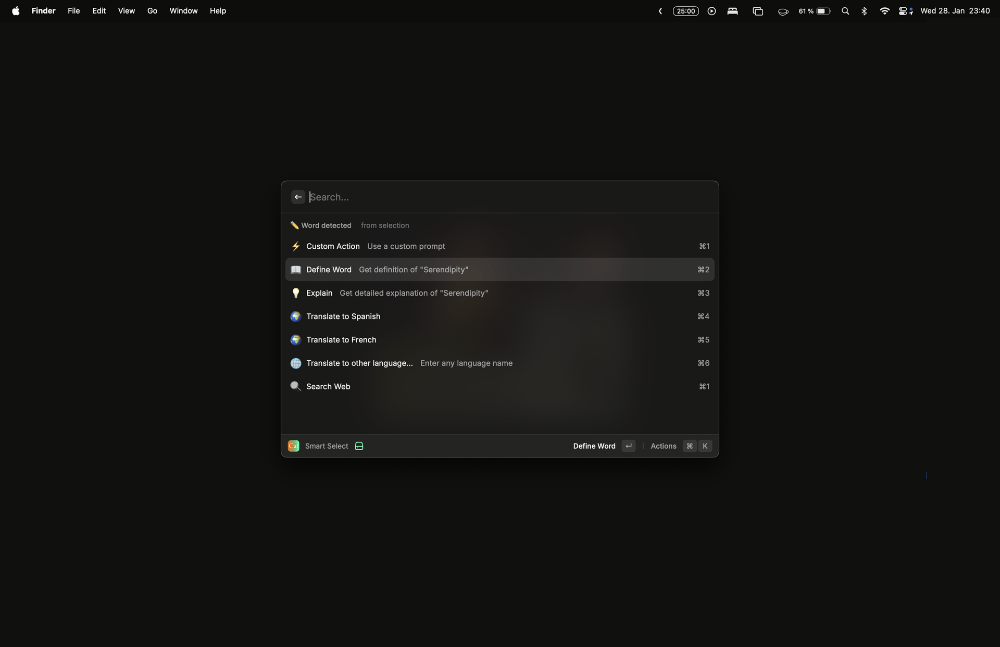
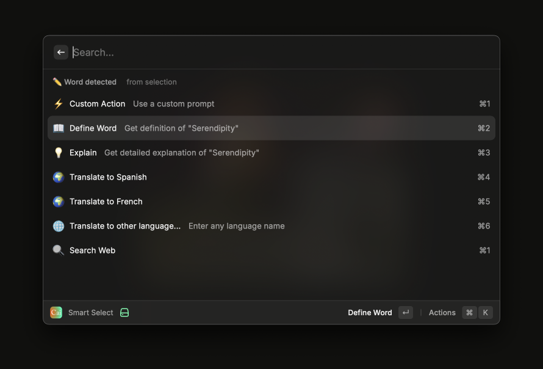
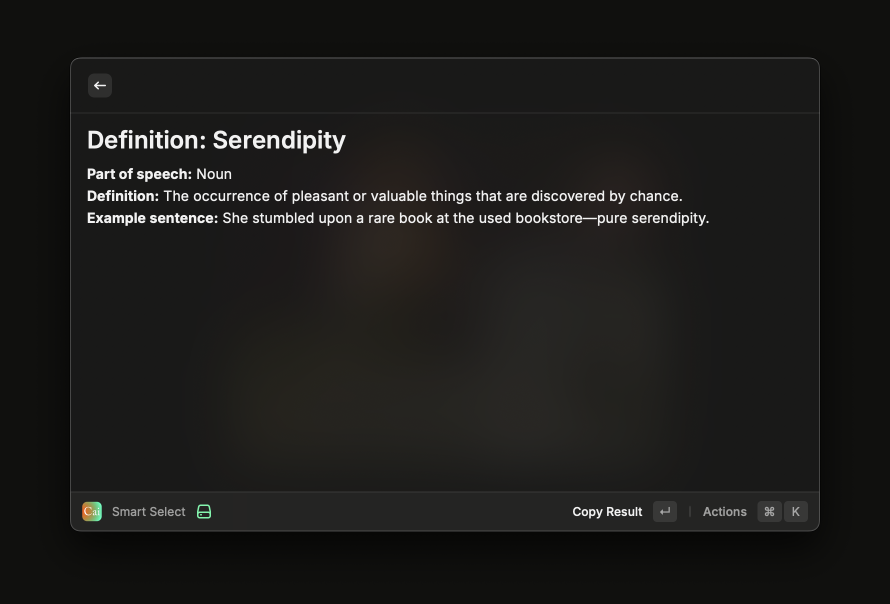
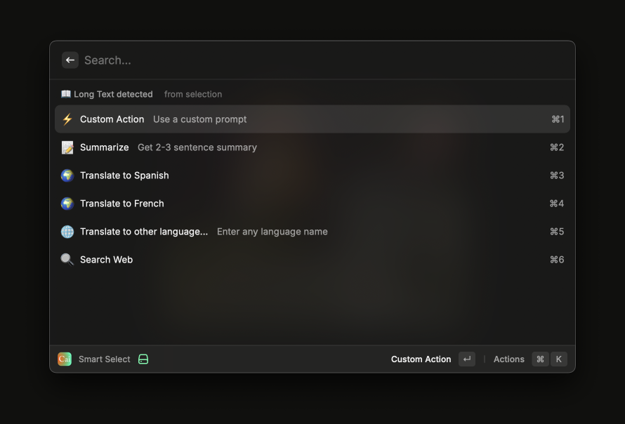
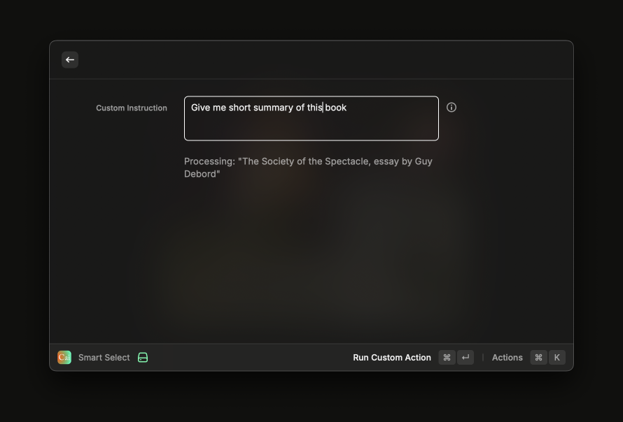
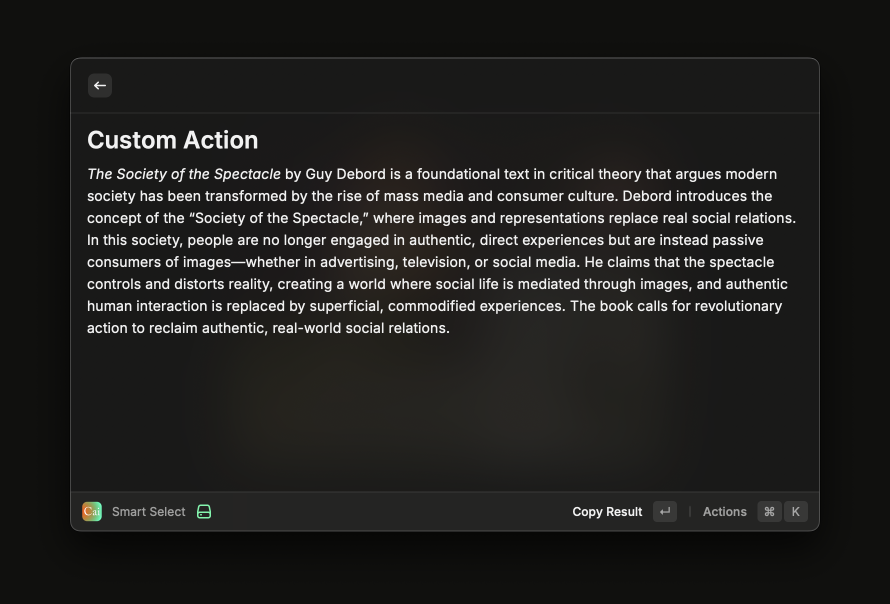
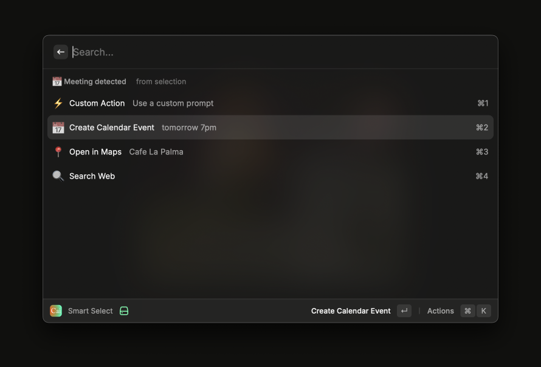
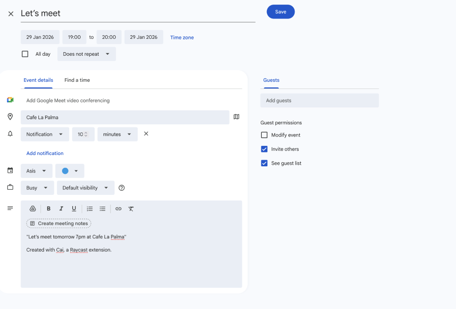
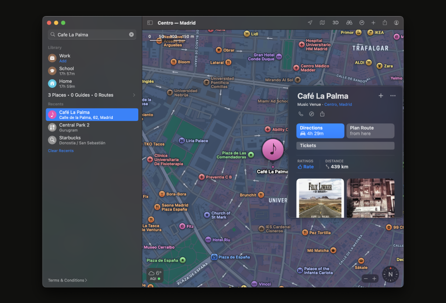

# Cai: Clipboard Action Intelligence

### Copy anything. Get smart actions.

**Privacy-first**: 100% local AI processing. Your data never leaves your machine.



A privacy-friendly, AI-powered clipboard assistant that analyzes copied content and suggests intelligent actions using locally-run language models, ensuring all data remains on-device and secure.

## ✨ Features

- 🔍 **Smart Content Detection**: Automatically identifies words, meetings, addresses, URLs, JSON, and more
- 🤖 **AI-Powered Actions**: Define words, explain concepts, translate text, summarize articles using local LLMs
- ⚡ **Custom Action (⌘1)**: Create your own AI action accessible via keyboard shortcut
- 🌍 **Flexible Translation**: Support for 10+ languages with custom language input
- 🗓️ **Quick Calendar Events**: Detect dates and create calendar events instantly
- 🗺️ **Location Actions**: Open addresses in Apple Maps (web on Windows) or Google Maps
- 🔒 **Privacy-First**: All AI processing happens locally - no cloud, no tracking
- ⚡ **Fast & Lightweight**: Instant analysis with minimal resource usage

## 📺 Screenshots

### Word Detection & Definition




### Text & Custom Actions





### Datetime and Location Actions





## 📦 Installation

1. Install from Raycast Store (coming soon!)
2. Or clone and run locally:
   ```bash
   git clone <repository-url>
   cd cai-clipboard-action-intelligence
   npm install
   npm run dev
   ```

## ⌨️ Recommended Keyboard Shortcuts

After installation, set up these shortcuts in Raycast Settings → Extensions → Cai:

| Command          | Recommended Shortcut | Description               |
| ---------------- | -------------------- | ------------------------- |
| **Smart Paste**  | `⌥V` (Option + V)    | Analyze clipboard content |
| **Smart Select** | `⌥C` (Option + C)    | Analyze selected text     |

**To set shortcuts:**

1. Open Raycast Settings (⌘,)
2. Go to **Extensions** tab
3. Find **Cai: Clipboard Action Intelligence**
4. Click on each command and assign the shortcut

## 🚀 Usage

### Smart Select (⌥C)

Select some text, trigger command and get suggested relevant actions.

**Examples:**

- Select `"serendipity"` → ⌘1 for custom action, ⌘2 to define, ⌘3 to explain, ⌘4-6 to translate
- Select `"Let's meet Tuesday at 3pm at Starbucks"` → Create calendar event, open in maps
- Select `"123 Main St, NYC 10001"` → Open in maps, copy formatted
- Select `https://github.com/...` → Open in browser, copy as markdown
- Select `{"name":"John"}` → Pretty print JSON, copy formatted

### Smart Paste (⌥V)

Analyzes your clipboard content and suggests relevant actions.

## 🤖 AI Setup (Optional)

For advanced features (define, translate, summarize), you'll need a local LLM server:

### Supported LLM Providers

| Provider                  | Default URL                 | Setup                                                        |
| ------------------------- | --------------------------- | ------------------------------------------------------------ |
| **LM Studio**             | `http://127.0.0.1:1234/v1`  | [Download](https://lmstudio.ai/) → Load model → Start server |
| **Ollama**                | `http://127.0.0.1:11434/v1` | [Install](https://ollama.ai/) → `ollama serve`               |
| **LocalAI**               | `http://127.0.0.1:8080/v1`  | [Setup guide](https://localai.io/)                           |
| **text-generation-webui** | `http://127.0.0.1:5000/v1`  | Enable OpenAI extension                                      |

**To configure:**

1. Install and start your preferred LLM server
2. Open Cai preferences in Raycast
3. Select your LLM provider
4. (Optional) Enter a specific model name

## 📝 Content Detection & Actions

Cai intelligently detects content and offers context-aware actions:

| Type           | Examples                                    | Actions                                                      |
| -------------- | ------------------------------------------- | ------------------------------------------------------------ |
| **Word**       | "serendipity", "photosynthesis"             | Custom Action (⌘1), Define, Explain, Translate, Search       |
| **Short Text** | "quantum computing is revolutionary"        | Custom Action (⌘1), Explain, Translate, Search Web/Wikipedia |
| **Long Text**  | Emails, articles (100+ chars)               | Custom Action (⌘1), Summarize, Translate, Search             |
| **Meeting**    | "Tuesday at 3pm", "Lunch tomorrow"          | Custom Action (⌘1), Create Calendar Event, Open in Maps      |
| **Address**    | "123 Main St, NYC", "Calle Mayor 5, Madrid" | Custom Action (⌘1), Open in Maps                             |
| **URL**        | "https://github.com/..."                    | Custom Action (⌘1), Open in Browser, Copy as Markdown        |
| **JSON**       | `{"key": "value"}`                          | Custom Action (⌘1), Pretty Print                             |

**Custom Action (⌘1)** is always available and can be configured in preferences to do anything you want (e.g., "Improve writing", "Create email reply", "Count words", "Convert to Python list").

## ⚙️ Configuration

Access preferences via Raycast Settings → Extensions → Cai:

- **LLM Provider**: Choose between LM Studio, Ollama, LocalAI, or custom
- **Custom LLM URL**: For self-hosted or other OpenAI-compatible servers
- **Model Name**: Specify a particular model (optional)
- **Translation Language 1 & 2**: Choose your preferred languages for quick translations
- **Custom Action Prompt**: Set your own AI instruction for the ⌘1 shortcut
- **Search Engine**: Brave Search (default), DuckDuckGo, Google, Bing, Ecosia
- **Maps App**: Apple Maps (default, web version on Windows) or Google Maps

## 🛠️ Development

```bash
# Install dependencies
npm install

# Run in development mode
npm run dev

# Build for production
npm run build

# Lint
npm run lint
```

## 📄 License

MIT

## 🙏 Credits

Built with:

- [Raycast API](https://developers.raycast.com)
- [chrono-node](https://github.com/wanasit/chrono) for date parsing
- Local LLM providers for AI features
